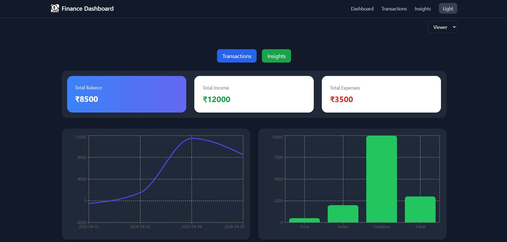
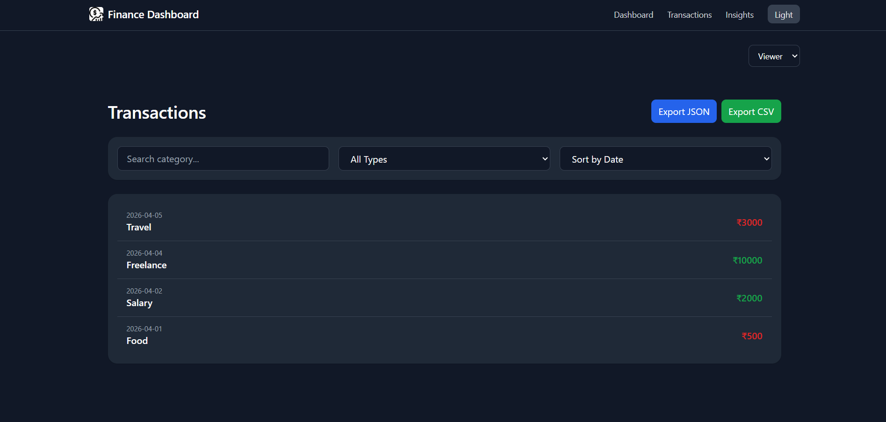
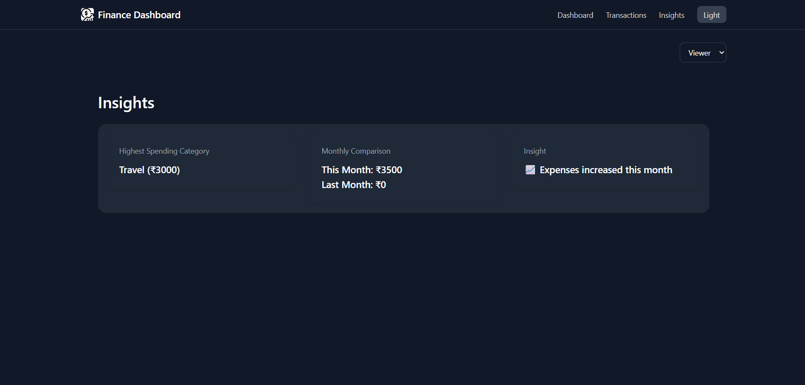

# Finance Dashboard

A modern, responsive finance dashboard built with React that helps users track income, expenses, and financial insights through interactive charts and clean UI.

---

## Features

*  **Dashboard Overview**

  * Total Balance, Income, Expenses
  * Time-based balance trend chart
  * Category-wise spending breakdown

*  **Transaction Management**

  * Add and delete transactions
  * Filter by category and type
  * Sort by date or amount

*  **Export Functionality**

  * Download transactions as **CSV** or **JSON**

*  **Role-Based Access Control (RBAC)**

  * Admin → Add/Delete transactions
  * Viewer → Read-only access

*  **Dark Mode**

  * Toggle between light and dark themes
  * Persisted using localStorage

*  **Responsive Design**

  * Works smoothly on mobile, tablet, and desktop

*  **Animations**

  * Smooth UI transitions using Framer Motion

---

##  Tech Stack

* React (Vite)
* Tailwind CSS
* Recharts (Charts)
* Framer Motion (Animations)
* Context API (State Management)
* LocalStorage / API (Optional backend)

---

##  Project Structure

```
├───assets/
├───components/
│   ├───dashboard/
│   ├───insights/
│   ├───layout/
│   ├───role/
│   └───transactions/
├───context/
├───data/
├───pages/
└───utils/
```
---

##  Installation & Setup

1. Clone the repository:

```bash
git clone https://github.com/mohitchauhan1324325/finance_Dashboard.git
```

2. Navigate to project:

```bash
cd finance-Dashboard
```

3. Install dependencies:

```bash
npm install
```

4. Run the app:

```bash
npm run dev
```

---

## 🔌 Mock API (JSON Server)

This project optionally supports a mock backend using JSON Server.

### Setup

1. Install JSON Server:

```bash
npm install -g json-server
```

2. Create a `db.json` file:

```json
{
  "transactions": []
}
```

3. Run the server:

```bash
json-server --watch db.json --port 3001
```

4. Update `.env`:

```env
VITE_USE_API=true
VITE_API_URL=http://localhost:3001/transactions
```

---

##  Environment Variables (Optional API Mode)

Create a `.env` file:

```
VITE_USE_API=true
VITE_API_URL=http://localhost:3001/transactions
```

---

##  Screenshots

###  Dashboard


###  Transactions


###  Insights


---

##  Key Learnings

* State management using Context API
* Building responsive UI with Tailwind CSS
* Data visualization using charts
* File export using Blob API
* Implementing dark mode with persistence
* Adding smooth animations using Framer Motion

---

##  Author

Mohit Chauhan

